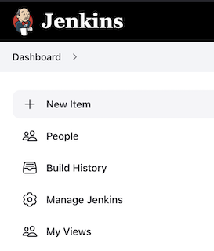
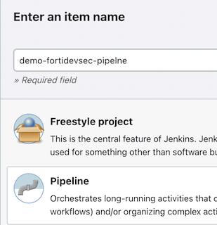
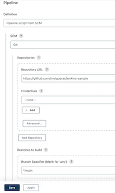
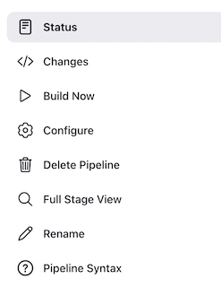

# FortiDevSec Jenkins Pipeline sample
## FortiDevSec

[FortiDevSec User Guide](https://docs.fortinet.com/document/fortidevsec/22.3.0/user-guide/546812/introduction)

## Integration with Jenkins pipelines

[FortiDevSec Jenkins CI/CD integration](https://docs.fortinet.com/document/fortidevsec/22.3.0/user-guide/792690/jenkins)

Paste this code segment in Jenkins > (Your App) > Configure > Add build step > Execute Shell for a SAST scan.

```
env | grep -E "JENKINS_HOME|BUILD_ID|GIT_BRANCH|GIT_COMMIT" > /tmp/env
docker pull registry.fortidevsec.forticloud.com/fdevsec_sast:latest
docker run --rm --env-file /tmp/env --mount type=bind,source=$PWD,target=/scan registry.fortidevsec.forticloud.com/fdevsec_sast:latest
```

Paste this code segment DAST scan.

```
env | grep -E "JENKINS_HOME|BUILD_ID|GIT_BRANCH|GIT_COMMIT" > /tmp/env
docker pull registry.fortidevsec.forticloud.com/fdevsec_dast:latest
docker run --rm --env-file /tmp/env --mount type=bind,source=$PWD,target=/scan registry.fortidevsec.forticloud.com/fdevsec_dast:latest 
```
## Deploy Jenkins pipeline SCM

1. Create new pipeline



2. Choose name and type pipeline 



3. Go to Pipeline section and complete like this

- Repository URL: https://github.com/jmvigueras/jenkins-sample
- Branches to build: */main
- Script Path: Jenkinsfile

- Save



4. Done - Test with Build Now

- Build Now



## Support
This a personal repository with goal of testing and demo Fortinet solutions on the Cloud. No support is provided and must be used by your own responsability. Cloud Providers will charge for this deployments, please take it in count before proceed.

## License
Based on Fortinet repositories with original [License](https://github.com/fortinet/fortigate-terraform-deploy/blob/master/LICENSE) © Fortinet Technologies. All rights reserved.


